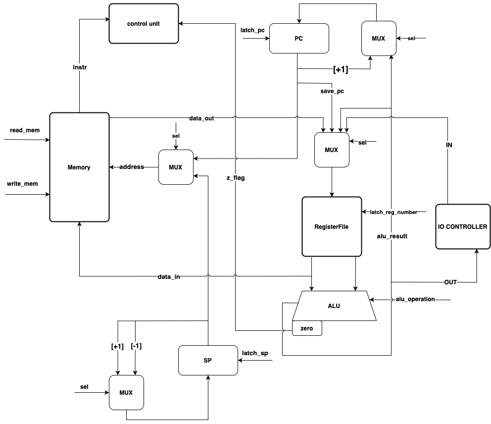
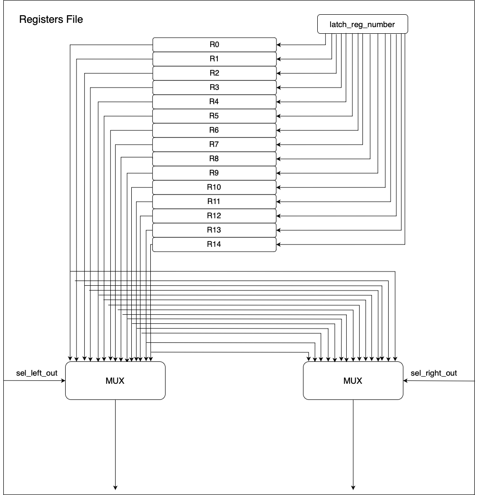
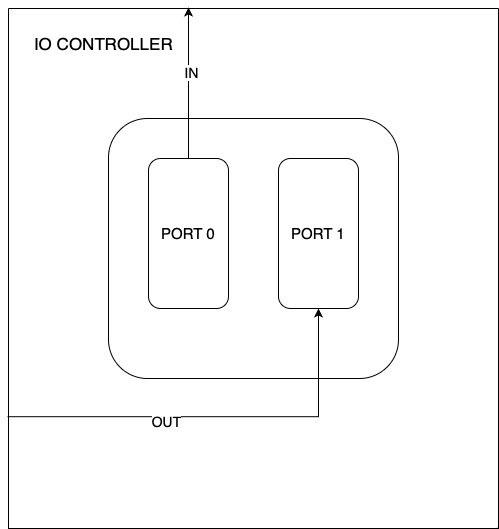
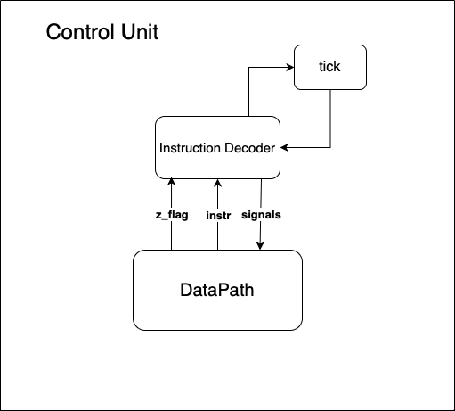

# Simple risc processor
- Ефимов Арслан Альбертович, P3232
- lisp -> asm | risc | neum | hw | instr | struct | stream | port | cstr | prob2 | cache
- Упрощенный вариант:
- asm | risc | neum | hw | instr | struct | stream | port | cstr | prob2 |

## Язык программирования
Синтаксис в расширенной БНФ:

```ebnf
<program> ::= <data_section> "\n" <text_section>

<data_section> ::= "section" "." "data" ":" [comment] "\n" {data}
<text_section> ::= "section" "." "text" ":" [comment] "\n" {instruction}

<data> ::= <identifier> ":" <data_value>

<data_value> ::= | <number>
                 | <string>
                 | "resb" <positive_integer>
                 | [<comment>]
                 
<instruction> ::= | ld <register> <address>
                  | st <register> <address>
                  | add <register> <register> <register>
                  | sub <register> <register> <register>
                  | mul <register> <register> <register>
                  | div <register> <register> <register>
                  | mod <register> <register> <register>
                  | cmp <register> <register> 
                  | inc <register> 
                  | dec <register>
                  | jmp <label>
                  | jz <label>
                  | jnz <label>
                  | in <register> <port>
                  | out <register> <port>
                  | mov <register> <argument>
                  | call <label>
                  | ret
                  | hlt
                  | <label_definition>
                  | [<comment>]

<digit> ::= [0-9]

<port> ::= "0" | "1"

<address> ::= "[" <identifier> "]" | <identifier>

<identifier> ::= <letter> { <letter> | <digit> }

<positive_integer> ::= <digit> { <digit> }

<number> ::= ["-"] <positive_integer>

<letter> ::= [a-zA-Z]

<comment> ::= ";" { <any symbol except "\n"> }

<argument> ::= <register> | #<number>

<register> ::= "r" <positive_integer>

<label> ::= "." <identifier>

<label_definition> ::= <label> ":"

<string> ::= "\"" { <character> } "\""

<character> ::= <letter> | <digit> | <special_char>

<special_char> ::= "." | "," | ";" | ":" | "!" | "?" | "'" | "(" | ")" | "[" | "]" | "{" | "}" | "+" | "-" | "*" | "/" | "=" | "<" | ">" | " " | "\t"
```

Команды:

| Команды     |                                                     Описание команды                                                      |
|:------------|:-------------------------------------------------------------------------------------------------------------------------:|
| `ld a b`    |                                  Загрузка значения из памяти по адресу `b` в регистр `a`                                  |
| `ld a [b]`  |                          Загрузка значения из памяти по адресу, находящемся в `b` в регистр `a`                           |
| `st a b`    |                                Сохранение значения из регистра `a` в память по адресу `b`                                 |
| `st a [b]`  |                         Сохранение значения из регистра `a` в память по адресу, находящемся в `b`                         |
| `add a b c` |                        Сложение содержимого регситров `b` и `c` и запись результата в регситр `a`                         |
| `sub a b c` |                   Вычитание содержимого из регситра `b` регистра `c` и запись результата в регситр `a`                    |
| `mul a b c` |                       Произведение содержимого регистров `b` и `c` и запись результат в регистр `a`                       |
| `div a b c` |        Целочисленное деление содержимого регситра `b` на содержимое регистра `c` и запись результат в регситр `a`         |
| `mod a b c` |          Деление с остатком содержимого регситра `b` на содержимое регистра `c` и запись результат в регситр `a`          |
| `cmp a b`   | Сравнение содержимого регистров `a` и `b`, выполнение операции (`a-b`) и выставление флага `zero` по результату сравнения |
| `inc a`     |                          Инкремент содержимого регистра `a`, то есть увеличение на 1. `a -> a+1`                          |
| `dec a`     |                          Декремент содержимого регистра `a`, то есть уменьшение на 1. `a -> a-1`                          |
| `jmp a`     |                                             Безусловный переход на адрес `a`                                              |
| `jz a`      |                              Условный переход на адрес `a`, если установлен флаг `zero = 1`                               |
| `jnz a`     |                                    Условный переход на адрес `a`, если флаш `zero = 0`                                    |
| `in a b`    |                                        Чтение значения из порта `b` в регистр `a`                                         |
| `out a b`   |                                        Запись содержимого регистра `a` в порт `b`                                         |
| `mov a b`   |              Загрузка значения из регистра `b` в регистр `a` или прямая загрузка значения `b` в регистр `a`               |
| `call a`    |                                         Вызов подпрограммы по указанной метке `a`                                         |
| `ret`       |                                                  Возврат из подпрограммы                                                  |
| `hlt`       |                                                     Останов программы                                                     |

Память выделяется статически при запуске модели, видимость данных -- глобальная. Виды литералов -- строковые и целочисленные

## Организация памяти
- Память соответствует фон Неймановской архитектуре
- Размер машинного слова - 32 бита.
- Модель включает в себя 15 регистров
- Все инструкции фиксированной длины
```text

           memory
+----------------------------+
| 00 : jmp n                 |
| 01 : data                  |
| 02 : ...                   |
| 03 : ...                   |
| n  : program start         | 
|                            |
|           ...              |
|                            |
|           ...              |
+----------------------------+
```
- Ячейка `0` соответствует инструкции `jmp`, осуществляющая переход на адрес первой инструкции в программе
- С ячейки памяти `1` начинается секция `.data`. Переменные могут быть четырех типов:
    - `Строковые` -- под которые отводится `n+1` ячеек памяти, где последняя (доп. символ) -- `нуль-терминатор`
    - `Целочисленные` -- под них отводится одна ячейка памяти
    - `Ссылочные` -- указывают на адрес другой переменной, под них отводится одна ячейка памяти
    - `Буферные` -- под них отводится `n` последовательных ячеек памяти, где `n` - значение из запроса на выделение [`resb n`]
- Переменные располагаются в памяти также последовательно, так, как прописаны в коде
- С ячейки памяти `n` начинается секция `.text`. В ней последовательно расположены инструкции

Регистры:
```text
+----------------------------+
|         Registers          |
+----------------------------+
|            r0              |
+----------------------------+
|            r1              |
+----------------------------+
|            r2              |
+----------------------------+
|            r3              |
+----------------------------+
|            r4              |
+----------------------------+
|            r5              |
+----------------------------+
|            r6              |
+----------------------------+
|            r7              |
+----------------------------+
|            r8              |
+----------------------------+
|            r9              |
+----------------------------+
|            r10             |
+----------------------------+
|            r11             |
+----------------------------+
|            r12             |
+----------------------------+
|            r13 - BR        |
+----------------------------+
|            r14 - DR        |
+----------------------------+

```
- Регистры `r0-r12` общего назначения и они могут быть использованы программистом как угодно
- Регистр `r13` -- это буферный регистр `BR`, используется для сохранения `PC` во время адресных инструкций `ld` и `st` (не доступен программисту)
- Регистр `r14` -- это регистр данных `DR`, в него сохраняются считанные инструкции (не доступен программисту)
- Регистры находятся в регистровом файле `RegistersFile`, который реализован в модуле [register_file.py](./registers_file.py)

## Система команд
- Машинное слово -- 32 бита
- Доступ к памяти осуществляется по адресу, находящемся в регистре `PC` -- programm counter. Установка адреса реализуется следующими способами:
    - Увеличение `PC` на `1`
    - Непосредственно из самого `ALU`
- Поддерживаются следующие виды адресации:
  - Абсолютная
  - Косвенная
  - Регистровая
  - Портовая

Также команда может быть безадресной
  
- Ввод-вывод осуществляется как поток токенов, port-mapped, управление вводом-выводом осуществляется с помощью `IO_CONTROLLER`.
Чтение происходит в регистр, запись также происходит из регистра.
- Поток управления:
  - Условные и безусловные переходы (`jz`, `jnz`, `jmp`)
  - Если инструкция это не переход, то после нее инкрементируем `PC`
- Способ кодирования инструкций - `struct`, использование `json` формата

## Набор инструкций
- Декодирование инструкций выполняется за `1` такт
- Выборка операнда или адреса зависит от типа адресации:
    - Прямая адресация - `2` такта
    - Косвенная адресация - `3` такта

| **Мнемоника** | Кол-во тактов | Описание                                                                                 |
|:-------------:|:-------------:|:-----------------------------------------------------------------------------------------|
|     `ld`      |      `2`      | Загружает значение из памяти по адресу в регистр                                         |
|     `st`      |      `2`      | Сохраняет значение из регистра в память по адресу                                        |
|     `add`     |      `2`      | Складывает значение двух регистров и сохраняет в третий                                  |
|     `sub`     |      `2`      | Вычитает значение одного регистра из другого и сохраняет в третий                        |
|     `div`     |      `2`      | Целочисленно делит значение одного регистра из другого и сохраняет в третий              |
|     `mul`     |      `2`      | Умножает значение одного регистра из другого и сохраняет в третий                        |
|     `mod`     |      `2`      | Делит с остатком значение одного регистра из другого и сохраняет в третий                |
|     `cmp`     |      `2`      | Сравнивает значения двух регистров путем вычитания и выставляет флаг `zero`              |
|     `inc`     |      `2`      | Увеличивает значение регистра на `1`                                                     |
|     `dec`     |      `2`      | Уменьшает значение регистра на `1`                                                       |
|     `jmp`     |      `1`      | Безусловный переход по адресу метки                                                      |
|     `jz`      |      `1`      | Условный переход по адресу метки, если `zero` == 1                                       |
|     `jnz`     |      `1`      | Условный переход по адресу метки, если `zero` == 0                                       |
|     `in`      |      `2`      | Прочитать значение по указанному порту в регистр                                         |
|     `out`     |      `2`      | Записать значение по указанному порту из регистра                                        |
|     `mov`     |      `2`      | Загрузка значения из регистра в регистр или непосредственная загрузка значения в регистр |
|    `call`     |      `4`      | Вызов подпрограммы, значение `PC` на вершину стека                                       |
|     `ret`     |      `3`      | Возврат из подпрограммы, возврщаем из вершины стека `PC`                                 |
|     `hlt`     |      `0`      | Останов программы                                                                        |

## Способ кодирования инструкций
- Машинный код сериализуется в список JSON.
- Один элемент списка - одна инструкция.

Пример:
```text
[
    {
        "opcode": "jz", 
        "arg": 4, 
        "addressing": 0, 
        "term": [
            6, 
            ".end", 
            "jz command"
        ]
    }
]
```
где:
- `opcode` -- строка с кодом операции
- `arg` -- аргумент инструкции (может отсутствовать)
- `addressing` -- тип адресации инструкции
- `term` -- кортежи для удобного восприятия машинного кода
    - `term[0]` -- индекс инструкции в памяти
    - `term[1]` -- метки, которые присутствуют в командах перехода
    - `term[2]` -- комментарии (опционально)
  
Типы данных в модуле [isa](./isa.py), где:

- `Opcode` -- перечисление кодов оперций;
- `Term` -- структура для описания фрагментов кода

## Транслятор
Интерфейс командной строки `python3 translator.py <source_file> <target_file>`
Реализовано в модуле [translator.py](./translator.py)

Принцип работы транслятора:
- На вход принимает два файла:
  - имя файла с исходным кодом `source_file`;
  - имя файла, куда запишутся машинные инструкции `target_file`
- Все ключевые этапы происходя в функции `translate`:
  - 1. Функция `clean_code` очищает код от лишних пробелов, табуляций, пустых строк, а также удаляет все комментарии
  - 2. Функция `translate_section_data` выделяет переменные, которые находятся в секции `.data`. Она добавляет их в список словаря, в нем содержатся целочисленные переменные, строки в формате `Unicode`, ссылки и директивы `resb`
  - 3. Функция `saved_all_labels_and_delete` добавляет все метки в список словаря со значением - адреса данной метки для условных переходов на инструкции
  - 4. Функция `translate_section_text` выделяет инструкции в секции `.text` и добавляет их в список с инструкциями
  - 5. Функция `convert_data_to_json` конвертирует секцию `.data` в JSON формат для записи в файл
  - 6. Функция `convert_text_to_json` конвертирует секцию `.text` в JSON формат для записи в файл
  - 7. Все данные и инструкции конвертируются в один список с JSON форматом
- Правила генерации машинного кода:
  - 1. для команд, однозначно соответствующих инструкциям, -- прямое отображение
  - 2. одна переменная -- одна строка
  - 3. в начале списка памяти находится инструкция `jmp n`, где `n` - адрес начала секции `.text`
  - 4. метки пишутся в отдельных строках
  
## Модель процессора
Интерфейс командной строки: `python3 machine.py <source_machine_code_file> <user_input_file>`. Реализовано в модуле [machine.py](./machine.py)
### DataPath

Реализован в классе `DataPath`
- Сигналы (обрабатываются за один такт, реализованы в виде методов класса):
  - `latch_reg_number` -- защелкнуть значение в регистр 
  - `latch_sp` -- защелкнуть значение в указатель стека `SP`
  - `latch_pc` -- защелкнуть значение в регистр `PC`
  - `read_mem` -- прочитать из памяти по адресу `PC` или `SP`
  - `write_mem` -- записать значение в память по адресу `PC` или `SP`
  - `zero_signal` -- cигнал нулевого значения в результате операции `alu`, сигнал идет в `ControlUnit` (флаг `zero`)
  - `+1` -- инкрементировать значение
  - `-1` -- декрементировать значение
- Флаги:
  - `zero` -- отражает наличие нулевого значения в результате операции `alu`

### RegistersFile

Реализован в классе `RegistersFile` в модуле [registers_file.py](/registers_file.py)

### IO CONTROLLER

Реализован в классе `IoController`
### ControlUnit


Реализован в классе `ControlUnit`
- Hardwired (реализовано полностью на Python).
- Метод `decode_and_execute_instruction` выполняет и декодирует инструкции (`1` такт декодирование)
- `tick` -- подсчет тактов

Особенности работы модели:
- Цикл симуляции осуществляется в функции `simulation`.
- Шаг моделирования соответствует одной инструкции с выводом состояния в журнал.
- Для журнала состояний процессора используется стандартный модуль logging.
- Количество инструкций для моделирования лимитировано. (4000)
- Остановка моделирования происходит при:
  - превышении лимита количества выполняемых инструкций;
  - исключении `EndIterationError` -- после выполнения инструкции `hlt`
## Тестирование
Тестирование выполняется при помощи golden test-ов.
- Тесты реализованы в [golden_test.py](/golden_test.py)
- Конфигурация тестов лежит в папке [golden](/golden)

Запустить тесты: `poetry run pytest . -v`

Обновить конфигурацию golden tests:  `poetry run pytest . -v --update-goldens`

CI при помощи Github Action:

```yaml
name: Run tests

on:
  push:
    branches:
      - main

jobs:
  test:
    runs-on: ubuntu-latest

    steps:
      - name: Checkout code
        uses: actions/checkout@v4

      - name: Set up Python
        uses: actions/setup-python@v4
        with:
          python-version: 3.12.3

      - name: Install dependencies
        run: |
          python3 -m pip install --upgrade pip
          pip3 install poetry
          poetry install

      - name: Run tests and collect coverage
        run: |
          poetry run pytest --verbose
          poetry run coverage run -m pytest
          poetry run coverage report
        env:
          CI: true

  lint:
    runs-on: ubuntu-latest

    steps:
      - name: Checkout code
        uses: actions/checkout@v4

      - name: Set up Python
        uses: actions/setup-python@v4
        with:
          python-version: 3.12.3

      - name: Install dependencies
        run: |
          python3 -m pip install --upgrade pip
          pip3 install poetry
          poetry install

      - name: Check code formatting with Ruff
        run: poetry run ruff format --check .

      - name: Run Ruff linters
        run: poetry run ruff check .

```

где:
- `poetry` -- управления зависимостями для языка программирования Python;
- `coverage` -- формирование отчёта об уровне покрытия исходного кода;
- `pytest` -- утилита для запуска тестов;
- `ruff` -- утилита для форматирования и проверки стиля кодирования.

Пример использования и журнал работы процессора на примере `sub`:
```shell
arslanefimov@arslanefimov risc_processor % cat examples/test_sub.txt
  section .data:
      a: 15
      b: 10
      sub_res: 0
  section .text:
      ld r1 a
      ld r2 b
      sub r3 r1 r2
      st r3 sub_res
      hlt
arslanefimov@arslanefimov risc_processor % python3 translator.py examples/test_sub.txt output
source LoC: 10, code instr: 9
----Translation finished!----
arslanefimov@arslanefimov risc_processor % cat output
[{"opcode": "jmp", "arg": 4, "addressing": 0, "term": [0, ".text", "jmp to instructions"]},
 {"data_section": 15, "term": [1, "", "int var"]},
 {"data_section": 10, "term": [2, "", "int var"]},
 {"data_section": 0, "term": [3, "", "int var"]},
 {"opcode": "ld", "register": "1", "arg": 1, "addressing": 0, "term": [4, "a", "ld command"]},
 {"opcode": "ld", "register": "2", "arg": 2, "addressing": 0, "term": [5, "b", "ld command"]},
 {"opcode": "sub", "register0": "3", "register1": "1", "register2": "2", "addressing": 2, "term": [6, "", "sub command"]},
 {"opcode": "st", "register": "3", "arg": 3, "addressing": 0, "term": [7, "sub_res", "st command"]},
 {"opcode": "hlt", "addressing": 3, "term": [8, "", "hlt command"]}]   
 arslanefimov@arslanefimov risc_processor % python3 machine.py output file_user_input.txt
2024-06-01 20:47:05,471 - DEBUG - TICK: 2   | PC 4   | BR: 0   | DR: jmp | SP 2048 | Z_FLAG: 0 
 | R0: 0  | R1: 0  | R2: 0  | R3: 0  | R4: 0  | R5: 0  | R6: 0  | R7: 0  | R8: 0  | R9: 0  | R10: 0  | R11: 0  | R12: 0  | 

2024-06-01 20:47:05,471 - DEBUG - TICK: 7   | PC 5   | BR: 4   | DR: ld  | SP 2048 | Z_FLAG: 0 
 | R0: 0  | R1: 15 | R2: 0  | R3: 0  | R4: 0  | R5: 0  | R6: 0  | R7: 0  | R8: 0  | R9: 0  | R10: 0  | R11: 0  | R12: 0  | 

2024-06-01 20:47:05,471 - DEBUG - TICK: 12  | PC 6   | BR: 5   | DR: ld  | SP 2048 | Z_FLAG: 0 
 | R0: 0  | R1: 15 | R2: 10 | R3: 0  | R4: 0  | R5: 0  | R6: 0  | R7: 0  | R8: 0  | R9: 0  | R10: 0  | R11: 0  | R12: 0  | 

2024-06-01 20:47:05,471 - DEBUG - TICK: 15  | PC 7   | BR: 5   | DR: sub | SP 2048 | Z_FLAG: 0 
 | R0: 0  | R1: 15 | R2: 10 | R3: 5  | R4: 0  | R5: 0  | R6: 0  | R7: 0  | R8: 0  | R9: 0  | R10: 0  | R11: 0  | R12: 0  | 

2024-06-01 20:47:05,471 - DEBUG - TICK: 20  | PC 8   | BR: 7   | DR: st  | SP 2048 | Z_FLAG: 0 
 | R0: 0  | R1: 15 | R2: 10 | R3: 5  | R4: 0  | R5: 0  | R6: 0  | R7: 0  | R8: 0  | R9: 0  | R10: 0  | R11: 0  | R12: 0  | 

2024-06-01 20:47:05,471 - DEBUG - TICK: 21  | PC 8   | BR: 7   | DR: hlt | SP 2048 | Z_FLAG: 0 
 | R0: 0  | R1: 15 | R2: 10 | R3: 5  | R4: 0  | R5: 0  | R6: 0  | R7: 0  | R8: 0  | R9: 0  | R10: 0  | R11: 0  | R12: 0  | 


Instruction count: 6, ticks: 21
----Execute finished!----
```

Пример проверки исходного кода:

```shell
arslanefimov@arslanefimov risc_processor % poetry run pytest . -v
=========================================================================== test session starts ===========================================================================
platform darwin -- Python 3.12.3, pytest-7.4.4, pluggy-1.5.0 -- /Users/arslanefimov/Library/Caches/pypoetry/virtualenvs/risc-machine-pGqzkjD7-py3.12/bin/python
cachedir: .pytest_cache
rootdir: /Users/arslanefimov/PycharmProjects/risc_processor
configfile: pyproject.toml
plugins: golden-0.2.2
collected 5 items                                                                                                                                                         

golden_test.py::test_translator_asm_and_machine[golden/hello_username.yml] PASSED                                                                                   [ 20%]
golden_test.py::test_translator_asm_and_machine[golden/cat.yml] PASSED                                                                                              [ 40%]
golden_test.py::test_translator_asm_and_machine[golden/prob2.yml] PASSED                                                                                            [ 60%]
golden_test.py::test_translator_asm_and_machine[golden/hello_world.yml] PASSED                                                                                      [ 80%]
golden_test.py::test_translator_asm_and_machine[golden/test_sub.yml] PASSED                                                                                         [100%]

============================================================================ 5 passed in 0.21s ============================================================================

arslanefimov@arslanefimov risc_processor % poetry run ruff check .
arslanefimov@arslanefimov risc_processor % poetry run ruff format .
6 files left unchanged
```
```text
| ФИО                       | алг               | LoC |  code инстр. | инстр. | такт. | вариант                                                                     |
| Ефимов Арслан Альбертович | cat               | 17  |  10          | 49     | 151   | asm | risc  | neum | hw | instr | struct | stream | port | cstr | prob2 | - |
| Ефимов Арслан Альбертович | hello_username    | 61  |  80          | 322    | 1178  | asm | risc  | neum | hw | instr | struct | stream | port | cstr | prob2 | - |
| Ефимов Арслан Альбертович | hello_world       | 17  |  25          | 102    | 365   | asm | risc  | neum | hw | instr | struct | stream | port | cstr | prob2 | - |
| Ефимов Арслан Альбертович | prob2             | 33  |  26          | 414    | 1439  | asm | risc  | neum | hw | instr | struct | stream | port | cstr | prob2 | - |
| Ефимов Арслан Альбертович | test_sub          | 10  |  9           | 6      | 21    | asm | risc  | neum | hw | instr | struct | stream | port | cstr | prob2 | - |
```

